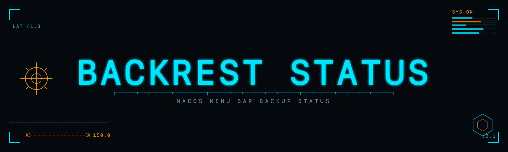

<p align="center">
  
</p>

<p align="center">
  <a href="https://github.com/garethgeorge/backrest"></a>
  <a href="LICENSE"></a>
  <a href="https://jeangalea.com"></a>
</p>

<p align="center"><b>A native macOS menu bar app that shows whether your <a href="https://github.com/garethgeorge/backrest">Backrest</a> backups are actually healthy.</b></p>

Backrest's built-in tray is a launcher. This sits in your menu bar and tells you, at a glance, whether every backup plan is current, running, or overdue, without opening the dashboard.

## Why

A backup that succeeded four days ago and then stopped running looks identical to one that ran an hour ago if you only check the last status. This app checks recency too: each plan is measured against its own schedule, so a plan that has gone quiet turns orange or red instead of staying green.

## What it shows

- A single menu bar glyph for overall state: healthy, running, warning, failed, or unreachable. State is carried by shape so it stays legible on any wallpaper in light and dark mode.
- A dropdown listing every plan with its last run time, and an "overdue" marker when a plan is past due.
- One click to open the Backrest web dashboard or force a refresh.

## How it works

It polls the local Backrest API every 15 seconds:

- `GetSummaryDashboard` for each plan's recent backup status and timestamps.
- `GetConfig` for each plan's schedule interval.

A plan is flagged overdue when its last backup is older than twice its configured interval, and failed when older than four times. No credentials are stored; it talks only to `127.0.0.1:9898`.

## Requirements

- macOS 14 or later
- A running Backrest instance reachable at `http://127.0.0.1:9898` with auth disabled (the default for a local install)

## Build and install

```sh
./build.sh
```

This compiles `main.swift` and assembles `Backrest Status.app` in the current directory. Then:

```sh
mv "Backrest Status.app" /Applications/
open -a "Backrest Status"
```

To keep it running across restarts, add it under System Settings → General → Login Items.

## License

MIT. See [LICENSE](LICENSE).
